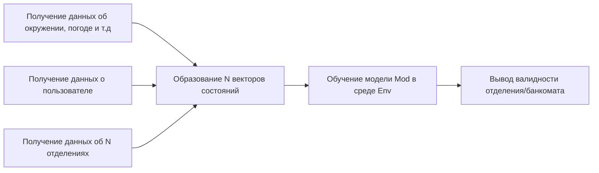
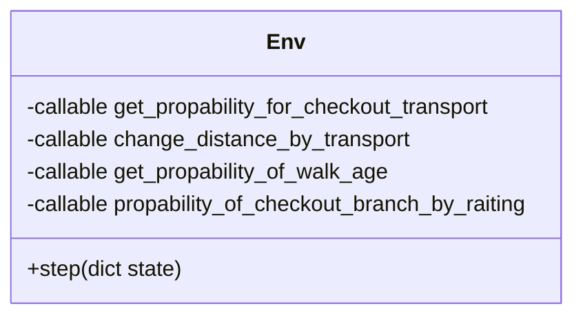

# Как работает алгоритм

# Описание сущностей
- Env - среда с вероятностным распределением принять то или иное решение;
- Mod - лёгкая модель, для быстрого обучение в среде;
- Вектор состояний - описан в ноутбуке create_env.ipynb

# Описание среды Env

**get_propability_for_checkout_transport** - вероятность транспорта отделения от отдалённости;

**change_distance_by_transport** - изменение дистанции от пути;

**get_propability_of_walk_age** - вероятность выбора отделения от дистанции и возраста;

**propability_of_checkout_branch_by_raiting** - вероятность выбора отделения от его рейтинга;

**step** - генерация вероятности выбора.

# P.S.
Крч. очень хитро модефицированный алгоритм отжига, работающий на распределении, а не на фикс значениях.