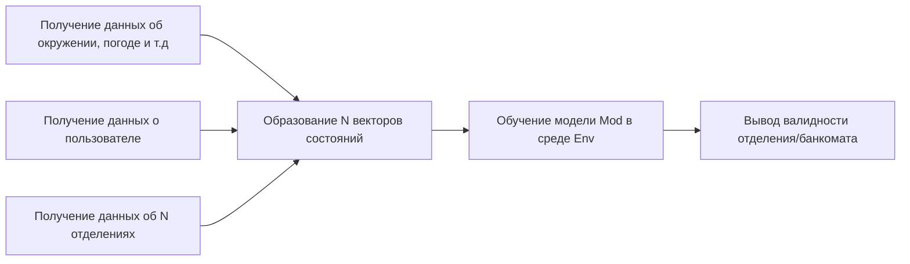

# Как работает алгоритм

# Описание сущностей
- Env - среда с вероятностным распределением принять то или иное решение;
- Mod - лёгкая модель, для быстрого обучение в среде;
- Вектор состояний - описан в ноутбуке create_env.ipynb

# Описание среды Env

# P.S.
Крч. очень хитро модефицированный алгоритм отжига.